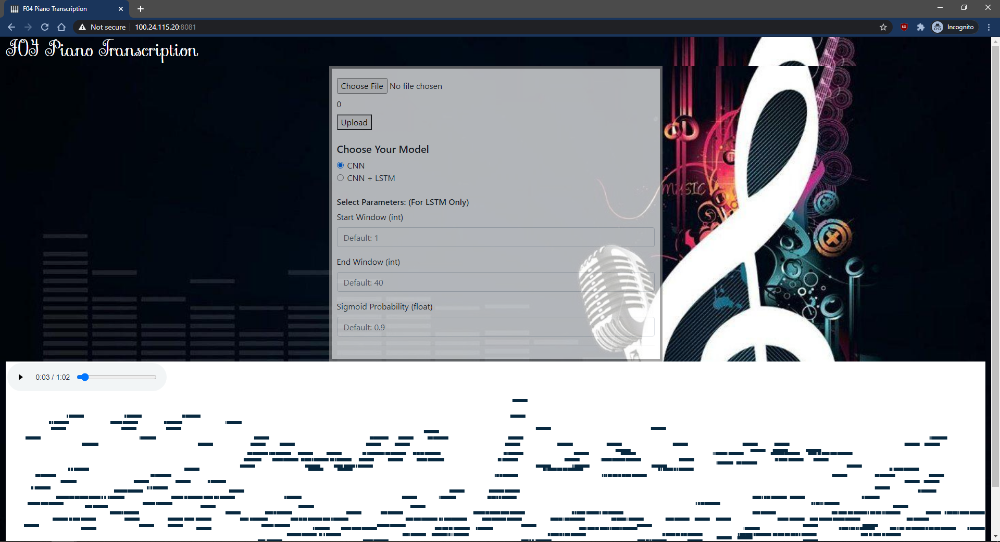

# F04 Music Transcription

## Abstract
A multi-model audio analysis tool, done periodically over a span of music wav files. Utilizing this model would produce a visual transcription that is able to show what specific notes are being played in the audio files.

## Demo (CNN ONLY) for LSTM-CNN model, please view instructions below on how to run locally
Hosted on [Heroku](https://www.heroku.com) and powered by [StreamLit](https://streamlit.io/).   
[Demo](https://f04musician.herokuapp.com/)

## Screenshot (OLD UI | LSTM-CNN model)


## Project Overview
It was noticed that in the music industry, talent and perfect pitch are what the musician is born with. Although it might be possible to train the ear to detect certain notes and melodies, it is mostly people with innate talent that are able to transcribe intricate songs into notes/sheet music with ease. This project aims to remove this limitation to help people with a strong passion for music to be able to play any song they desire even when the sheet music is not available to them and that they do not have the talent of having a perfect pitch.
This project utilizes the forms of machine learning algorithms, CNN and Long Short-Term Memory (LSTM), in an attempt to resolve the problems in AMT.

## Dataset
MIDI Aligned Piano Sounds (MAPS) dataset is used for training and testing the two models. The dataset consists of 29910 piano recordings in .wav file format, categorised into nine folders based on the different instruments used, and their recording conditions. Within each folder, the piano sound files are further categorised based on the audio characteristics into four sets ISOL,RAND, UCHO and MUS set.The MAPS recordings are sampled with a sampling frequency of 44kHz, and each recording is paired with a .txt file, which records the onset and offset time for all the notes that are played with its corresponding midi number. The .txt file will be used as a ground truth to evaluate the performance of the models. In our initial model - CNN only model, only the ISOL file is used for training, whereas the entire dataset is used to train our final model - CNN + LSTM model.

## Technical Details
Please refer to our [report](./F04_Report.pdf)

## Installation
Either run it locally or on an AWS EC2 Instance (XLarge with 32GB Disk Storage on Ubuntu LTS 20.X). You will need to have the following packages found under Technologies to run.


```npm install```
```npm run dev```

Please note that the LSTM_model.pt is not included in ./machine_learning/model as the file size exceed GitHub allowed file size. As such download [here](https://drive.google.com/file/d/1ZOWupNr_J1WU6m0zaaNqDlFS3VpUrv0Y/view) and import it over.

## Technologies
- [React](https://reactjs.org/)
- [NodeJS](https://nodejs.org/en/)
- [PyTorch](https://pytorch.org/)
- [MIDIUtil](https://pypi.org/project/MIDIUtil/)
- [Scipy](https://pypi.org/project/scipy/)
- [nnAudio](https://github.com/KinWaiCheuk/nnAudio)

## Done By:
- [Koh Ling Tian](https://github.com/ltiinagn)
- [Noah Lim Ren Dong](https://github.com/scizora)
- [Yong Wen Xin](https://github.com/yongwenxin)
- [Phang Teng Fone](https://github.com/tengfone)
